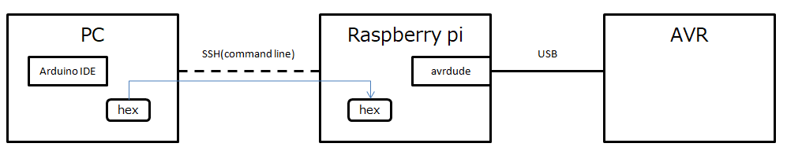

# AVR

## Target Device

| Device           | MCU    | Note                          | CLT | IDE |
|------------------|------------|------------------------------ |------|------|
| Arduino Uno     | ATmega328P       |  |?|〇|
| Arduino Nano     | ATmega328P       |  |?|〇|
| Arduino Leonardo     | ATMega32U4       | supports usb device role |?|〇|

## Command Line Tool
1.  **avrdude**, for Raspberry Pi(raspbian), Linux, Windows. use hex file ([URL1](http://kemarin-tech.blog.jp/archives/23415917.html), [URL2](https://make.kosakalab.com/make/electronic-work/avr-dev_for_raspberry-pi/))
1.  **avrgirl**, for Browser Serial API ([URL1](https://make.kosakalab.com/make/electronic-work/rasp-pi-arduino-1/))

## IDE
1.  Arduino
1.  [Atmel Studio](http://www.jh4vaj.com/archives/12088)

## Others
1.  [ArduinoISP](https://github.com/arduino/ArduinoISP), Arduino Application

## Examples
  